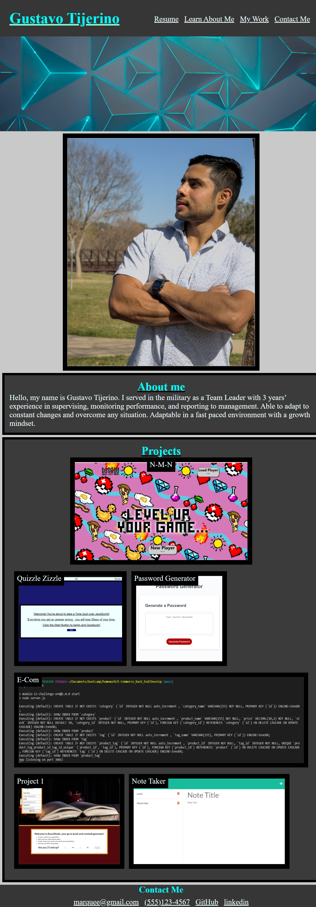

# react_portfolio

## Description
This portfolio is purely done with React.

## Table of Contents
- [Installation](#installation)
- [Usage](#usage)
- [Credits](#credits)
- [License](#license)
- [Contact me](#contact-me)
- [Deployed Page](#deployed-page)

## Installation

 You need to install React.

## Usage

## Deployed Page
[All About Me](https://gustavotijerino1.github.io/react_portfolio/)

## License

 MIT License

## Credits 

Craig

## Contact me
How to reach me if you have any additional questions.

[GitHub](https://github.com/GustavoTijerino1)

Email: busg26@gmail.com